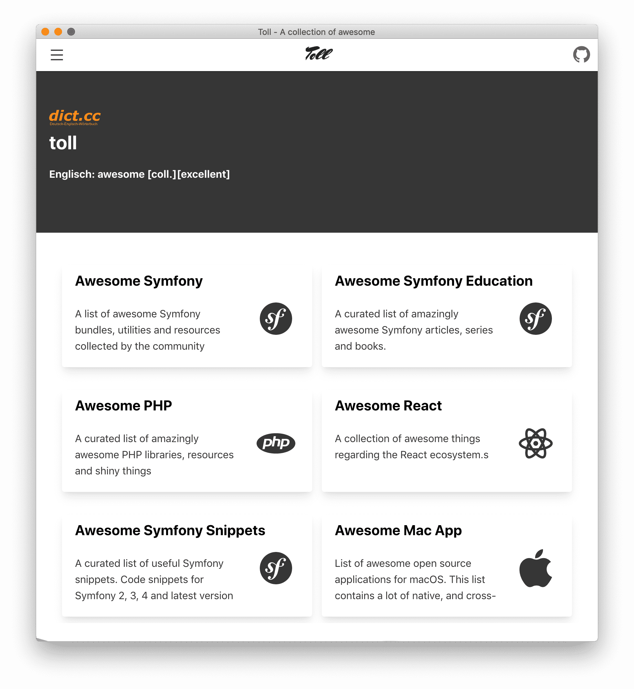

<div align="center">
  
  <h3>Toll</h3>
  <p>A collection of the Awesome collection found in GitHub</p>
  <p>powered by svelte and svelte markdown parser</p>

  <p>
    <a href="#">
      
    </a>
    <a href="#">
      
    </a>
  </p>
</div>

---

## install
```bash
npm install 
```


## dev
```bash
npm run dev 
```

## build
```bash
npm run build 
```

## licence

MIT [@vikbert](https://vikbert.github.io/)
